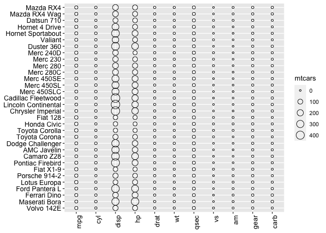
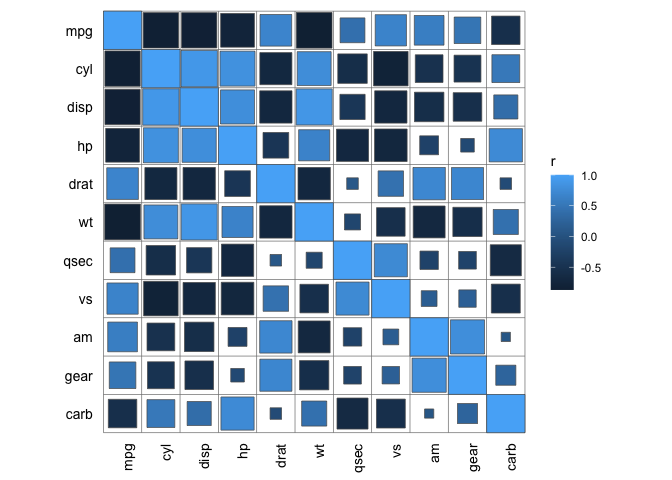
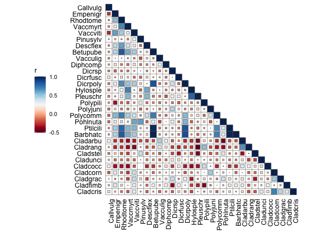
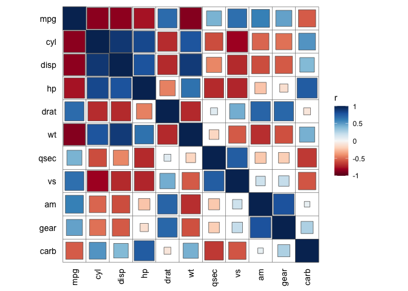
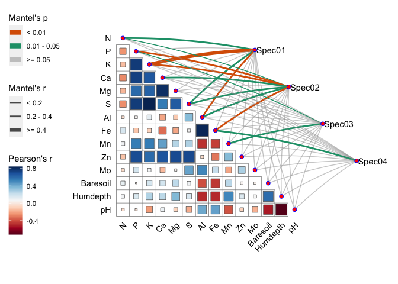
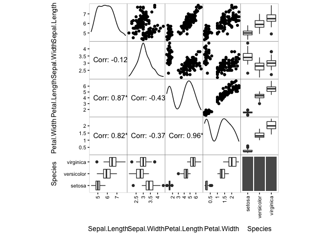

<!-- README.md is generated from README.Rmd. Please edit that file -->

# linkET

<!-- badges: start -->
<!-- badges: end -->

The goal of `linkET` is to visualize simply and directly a matrix
heatmap based on ‘ggplot2’. **Note: all functions of network have been
merged in netET package.**

## Installation

You can install the released version of `linkET` from
[GitHub](https://github.com/) with:

``` r
# install.packages("devtools")
devtools::install_github("Hy4m/linkET", force = TRUE)
packageVersion("linkET")
```

## Example

This is a basic example which shows you how to solve a common problem:

### Data processing

``` r
library(linkET)
## matrix_data
matrix_data(list(mtcars = mtcars))
#> A matrix data object:
#> Number:  1 
#> Names:  mtcars 
#> Dimensions:  32 rows, 11 columns
#> Row names:  Mazda RX4, Mazda RX4 Wag, Datsun 710, Hornet 4 Drive, Hor... 
#> Column names:  mpg, cyl, disp, hp, drat, wt, qsec, vs, am, gear, carb

## md_tbl
matrix_data(list(mtcars = mtcars)) %>% 
  as_md_tbl()
#> # A tibble: 352 × 3
#>    .rownames         .colnames mtcars
#>  * <chr>             <chr>      <dbl>
#>  1 Mazda RX4         mpg         21  
#>  2 Mazda RX4 Wag     mpg         21  
#>  3 Datsun 710        mpg         22.8
#>  4 Hornet 4 Drive    mpg         21.4
#>  5 Hornet Sportabout mpg         18.7
#>  6 Valiant           mpg         18.1
#>  7 Duster 360        mpg         14.3
#>  8 Merc 240D         mpg         24.4
#>  9 Merc 230          mpg         22.8
#> 10 Merc 280          mpg         19.2
#> # … with 342 more rows

## as method
as_matrix_data(mtcars)
#> A matrix data object:
#> Number:  1 
#> Names:  mtcars 
#> Dimensions:  32 rows, 11 columns
#> Row names:  Mazda RX4, Mazda RX4 Wag, Datsun 710, Hornet 4 Drive, Hor... 
#> Column names:  mpg, cyl, disp, hp, drat, wt, qsec, vs, am, gear, carb

as_md_tbl(mtcars)
#> # A tibble: 352 × 3
#>    .rownames         .colnames mtcars
#>  * <chr>             <chr>      <dbl>
#>  1 Mazda RX4         mpg         21  
#>  2 Mazda RX4 Wag     mpg         21  
#>  3 Datsun 710        mpg         22.8
#>  4 Hornet 4 Drive    mpg         21.4
#>  5 Hornet Sportabout mpg         18.7
#>  6 Valiant           mpg         18.1
#>  7 Duster 360        mpg         14.3
#>  8 Merc 240D         mpg         24.4
#>  9 Merc 230          mpg         22.8
#> 10 Merc 280          mpg         19.2
#> # … with 342 more rows

## special function for correlation matrix
correlate(mtcars) %>% 
  as_matrix_data()
#> A matrix data object:
#> Number:  2 
#> Names:  r, p 
#> Dimensions:  11 rows, 11 columns
#> Row names:  mpg, cyl, disp, hp, drat, wt, qsec, vs, am, gear, carb 
#> Column names:  mpg, cyl, disp, hp, drat, wt, qsec, vs, am, gear, carb

correlate(mtcars) %>% 
  as_md_tbl()
#> # A tibble: 121 × 4
#>    .rownames .colnames      r        p
#>  * <chr>     <chr>      <dbl>    <dbl>
#>  1 mpg       mpg        1     0       
#>  2 cyl       mpg       -0.852 6.11e-10
#>  3 disp      mpg       -0.848 9.38e-10
#>  4 hp        mpg       -0.776 1.79e- 7
#>  5 drat      mpg        0.681 1.78e- 5
#>  6 wt        mpg       -0.868 1.29e-10
#>  7 qsec      mpg        0.419 1.71e- 2
#>  8 vs        mpg        0.664 3.42e- 5
#>  9 am        mpg        0.600 2.85e- 4
#> 10 gear      mpg        0.480 5.40e- 3
#> # … with 111 more rows
```

### Heatmap

``` r
library(ggplot2)
matrix_data(list(mtcars = mtcars)) %>% 
  hyplot(aes(fill = mtcars)) +
  geom_tile()
```


``` r
as_md_tbl(mtcars) %>% 
  hyplot(aes(size = mtcars)) +
  geom_point(shape = 21, fill = NA)
```



``` r
correlate(mtcars) %>% 
  as_md_tbl() %>% 
  qcorrplot() +
  geom_square()
```



``` r
library(vegan)
#> 载入需要的程辑包：permute
#> 载入需要的程辑包：lattice
#> This is vegan 2.6-4
data("varespec")
data("varechem")
correlate(varespec[1:30], varechem) %>% 
  qcorrplot() +
  geom_square() +
  scale_fill_gradientn(colours = RColorBrewer::brewer.pal(11, "RdBu"))
```


``` r
qcorrplot(varespec[1:30], type = "lower") +
  geom_square() +
  scale_fill_gradientn(colours = RColorBrewer::brewer.pal(11, "RdBu"))
#> The input data is not a correlation matrix,
#> you can override this behavior by setting the `is_corr` parameter.
```



``` r
## you can set your style
set_corrplot_style()
qcorrplot(mtcars) + geom_square()
#> The input data is not a correlation matrix,
#> you can override this behavior by setting the `is_corr` parameter.
```



``` r
## reset to default style
set_default_style()
```

## mantel test

``` r
library(dplyr)
#> 
#> 载入程辑包：'dplyr'
#> The following objects are masked from 'package:stats':
#> 
#>     filter, lag
#> The following objects are masked from 'package:base':
#> 
#>     intersect, setdiff, setequal, union
data("varechem", package = "vegan")
data("varespec", package = "vegan")

mantel <- mantel_test(varespec, varechem,
                      spec_select = list(Spec01 = 1:7,
                                         Spec02 = 8:18,
                                         Spec03 = 19:37,
                                         Spec04 = 38:44)) %>% 
  mutate(rd = cut(r, breaks = c(-Inf, 0.2, 0.4, Inf),
                  labels = c("< 0.2", "0.2 - 0.4", ">= 0.4")),
         pd = cut(p, breaks = c(-Inf, 0.01, 0.05, Inf),
                  labels = c("< 0.01", "0.01 - 0.05", ">= 0.05")))
#> `mantel_test()` using 'bray' dist method for 'spec'.
#> `mantel_test()` using 'euclidean' dist method for 'env'.

qcorrplot(correlate(varechem), type = "lower", diag = FALSE) +
  geom_square() +
  geom_couple(aes(colour = pd, size = rd), 
              data = mantel, 
              curvature = nice_curvature()) +
  scale_fill_gradientn(colours = RColorBrewer::brewer.pal(11, "RdBu")) +
  scale_size_manual(values = c(0.5, 1, 2)) +
  scale_colour_manual(values = color_pal(3)) +
  guides(size = guide_legend(title = "Mantel's r",
                             override.aes = list(colour = "grey35"), 
                             order = 2),
         colour = guide_legend(title = "Mantel's p", 
                               override.aes = list(size = 3), 
                               order = 1),
         fill = guide_colorbar(title = "Pearson's r", order = 3))
```



## pairs plot

``` r
qpairs(iris) + geom_pairs()
#> Warning: 'use_md' has been deprecated,
#> please set 'parse' parameter instead.
```



## Citation

To cite linkET in publications use:

Houyun Huang(2021). linkET: Everything is Linkable. R package version
0.0.3.
